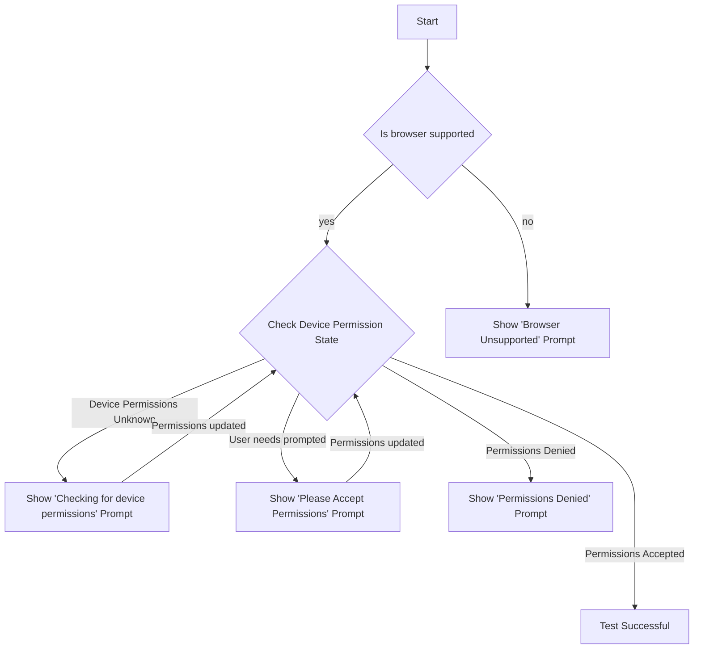

# Creating a Call Readiness Experience using Azure Communication Services

[!INCLUDE [Public Preview Notice](../includes/public-preview-include.md)]

In this tutorial, we'll be leveraging Azure Communication Services with the UI Library to create an experience that gets users ready to join a call. The UI Library provides a set of rich components and UI controls that can be leveraged to produce a Call Readiness experience, whilst the Azure Communication Calling JavaScript SDK provides a rich set of APIs to understand the user state.

## Download code

Access the full code for this tutorial on [GitHub](https://github.com/Azure-Samples/communication-services-javascript-quickstarts/tree/main/ui-library-call-readiness).

## Prerequisites

- [Visual Studio Code](https://code.visualstudio.com/) on one of the [supported platforms](https://code.visualstudio.com/docs/supporting/requirements#_platforms).
- [Node.js](https://nodejs.org/), Active LTS and Maintenance LTS versions (10.14.1 recommended). Use the `node --version` command to check your version.

## Overview

Users have several `speedbumps to get over`. This tutorial focuses on the two most impactful of these: "Am I using an unsupported browser" and "Have I given the browser permission to use my microphone and camera" and guides the user through issues they run into if they are on an unsupported browser or have not given
the site permission to use the microphone and camera.

The diagram below shows the flow the call readiness checker performs:



### Set Up React App

We'll use the create-react-app template for this quickstart. For more information, see: [Get Started with React](https://reactjs.org/docs/create-a-new-react-app.html)

```bash

npx create-react-app ui-library-quickstart-composites --template typescript

cd ui-library-quickstart-composites

```

At the end of this process, you should have a full application inside of the folder `ui-library-quickstart-composites`.
For this quickstart, we'll be modifying files inside of the `src` folder.

### Install the Package

Use the `npm install` command to install the Azure Communication Services Calling SDK and UI Library for JavaScript.

```bash

npm install @azure/communication-calling@dev @azure/communication-react@dev

```

For this tutorial we will also use FluentUI for creating UI controls:

```bash

npm install @fluentui/react @fluentui/react-icons

```

### Setup App with FluentUI

Here we will replace the create-react-app default `App.tsx` content with a basic setup that registers the necessary icons we will use in this tutorial, as well as setting a theme provider that can be used to set a custom theme in the future:

`App.tsx`

```tsx

import { FluentThemeProvider, useTheme } from '@azure/communication-react';
import { initializeIcons, registerIcons, Stack, Text } from '@fluentui/react';
import {
  DEFAULT_COMPONENT_ICONS
} from '@azure/communication-react';
import { CheckmarkCircle48Filled } from '@fluentui/react-icons';

// Initializing and registering icons should only be done once per app.
initializeIcons();
registerIcons({ icons: DEFAULT_COMPONENT_ICONS });

/**
 * Entry point of a React app.
 */
const App = (): JSX.Element => {
  return (
    <FluentThemeProvider>
      <TestComplete />
    </FluentThemeProvider>
  );
}

/**
 * UI for this tutorial to display when the tests have complete.
 * Instead of this, in your calling application you would take
 * the user to the next page in your app.
 */
export const TestComplete = (): JSX.Element => {
  const theme = useTheme();
  return (
    <Stack verticalFill verticalAlign="center" horizontalAlign="center" tokens={{ childrenGap: '1rem' }}>
      <CheckmarkCircle48Filled primaryFill={theme.palette.green} />
      <Text variant='xLarge'>Test Complete</Text>
    </Stack>
  );
};

export default App;

```

You should see a green checkmark with a `Test Complete` message.

### Run Create React App

Let's test our setup by running:

```bash

npm start

```

## Adding the call readiness flow

Next we will checks that will ensure the user is in the best state before joining a call.

### Preparing Your Session Page

Create a new file called `PreparingYourScreen.tsx` where we will create a spinner to show to the user while we perform asynchronous checks in the background:

`PreparingYourScreen.tsx`

```tsx
import { useTheme } from '@azure/communication-react';
import { ISpinnerStyles, IStackItemStyles, IStackStyles, ITextStyles, ITheme, Spinner, Stack, Text } from '@fluentui/react';

export const PreparingYourSession = (props: { callTitle?: string; callDescription?: string }): JSX.Element => {
  const theme = useTheme();
  return (
    <Stack verticalFill verticalAlign="center" horizontalAlign="center" tokens={{ childrenGap: '3rem' }}>
      {props.callTitle && (
        <Stack.Item>
          <Stack horizontalAlign="center" tokens={{ childrenGap: '1rem' }}>
            <Stack.Item styles={callTitleContainerStyles}>
              <Text styles={headingStyles} variant="large">
                {props.callTitle}
              </Text>
            </Stack.Item>
            {props.callDescription && (
              <Stack.Item styles={callDetailsContainerStyles}>
                <Text variant="medium">{props.callDescription}</Text>
              </Stack.Item>
            )}
          </Stack>
        </Stack.Item>
      )}
      <Stack.Item>
        <Stack horizontalAlign="center" tokens={{ childrenGap: '2rem' }} styles={preparingYourSessionStyles}>
          <Stack.Item>
            <Stack styles={spinnerContainerStyles(theme)}>
              <Spinner styles={spinnerStyles} />
            </Stack>
          </Stack.Item>
          <Stack.Item>
            <Stack horizontalAlign="center">
              <Stack.Item>
                <Text styles={headingStyles} variant="large">
                  Preparing your session
                </Text>
              </Stack.Item>
              <Stack.Item>
                <Text variant="medium">Please be patient</Text>
              </Stack.Item>
            </Stack>
          </Stack.Item>
        </Stack>
      </Stack.Item>
    </Stack>
  );
};

const preparingYourSessionStyles: IStackItemStyles = {
  root: {
    paddingTop: '2rem',
    paddingBottom: '3rem'
  }
};

const callTitleContainerStyles: IStackItemStyles = {
  root: {
    marginLeft: '2rem',
    marginRight: '2rem',
    maxWidth: '40rem',
    textAlign: 'center'
  }
};

const callDetailsContainerStyles: IStackItemStyles = {
  root: {
    marginLeft: '2rem',
    marginRight: '2rem',
    maxWidth: '40rem',
    textAlign: 'center',

    // Support ellipsis for long text
    display: 'block',
    textOverflow: 'ellipsis',
    overflow: 'hidden',
    whiteSpace: 'nowrap',

    // For browsers that support it, have multiple lines of text before ellipsis kicks in
    '@supports (-webkit-line-clamp: 2)': {
      display: '-webkit-box',
      whiteSpace: 'initial',
      '-webkit-line-clamp': '4',
      '-webkit-box-orient': 'vertical'
    }
  }
};

const headingStyles: ITextStyles = {
  root: {
    fontWeight: '600',
    lineHeight: '2rem'
  }
};

const spinnerStyles: ISpinnerStyles = {
  circle: {
    height: '2.75rem',
    width: '2.75rem',
    borderWidth: '0.2rem'
  }
};

const spinnerContainerStyles = (theme: ITheme): IStackStyles => ({
  root: {
    padding: '1.75rem',
    borderRadius: '50%',
    background: theme.palette?.themeLighterAlt
  }
});
```

### Creating Call Readiness Prompts

First we will create a prompt to tell the user they are using an unsupported browser. For this we will host the UI Library's `UnsupportedBrowser` component inside a FluentUI `modal`:

`UnsupportedBrowserPrompt.tsx`

```tsx
import { UnsupportedBrowser } from '@azure/communication-react';
import { Modal } from '@fluentui/react';

export const BrowserUnsupportedPrompt = (props: { isOpen: boolean }): JSX.Element => (
  <Modal isOpen={props.isOpen}>
    <UnsupportedBrowser
      onTroubleshootingClick={() => alert('This callback should be used to take the user to further troubleshooting')}
    />
  </Modal>
);
```

Next we will create a series of device permissions prompts to get users into a state where they have accepted the microphone and camera permissions. These will use the `CameraAndMicrophoneDomainPermissions` component
from the UI Library. Like the Unsupported Browser prompt, we will also host these inside a FluentUI `modal`.

`DevicePermissionPrompts.tsx`

```tsx
import { CameraAndMicrophoneDomainPermissions } from '@azure/communication-react';
import { Modal } from '@fluentui/react';

export const AcceptDevicePermissionRequestPrompt = (props: { isOpen: boolean }): JSX.Element => (
  <PermissionsModal isOpen={props.isOpen} type="request" />
);

export const CheckingDeviceAccessPrompt = (props: { isOpen: boolean }): JSX.Element => (
  <PermissionsModal isOpen={props.isOpen} type="check" />
)

export const PermissionsDeniedPrompt = (props: { isOpen: boolean }): JSX.Element => (
  <PermissionsModal isOpen={props.isOpen} type="denied" />
);

const PermissionsModal = (props: { isOpen: boolean, type: "denied" | "request" | "check" }): JSX.Element => (
  <Modal isOpen={props.isOpen}>
    <CameraAndMicrophoneDomainPermissions
      appName={'this site'}
      type={props.type}
      onTroubleshootingClick={() => alert('This callback should be used to take the user to further troubleshooting')}
    />
  </Modal>
);
```

To isolate our code that checks browser support and device permissions from the UI, we will create a checker class that can perform the call readiness checks:

`CallReadinessChecker.ts`

```ts
import { CallClient, DeviceAccess, Features } from "@azure/communication-calling";

/**
 * A helper class to perform call readiness related checks.
 *
 * Functionality:
 * - Check if the browser is supported.
 * - Check if the user should be prompted for camera and microphone permissions.
 * - Request camera and microphone permissions.
 */
export class CallReadinessChecker {
  private callClient: CallClient;

  /**
   * @param callClient use an existing callClient instance. If this is not supplied a new instance will be created.
   */
  constructor(callClient?: CallClient) {
    this.callClient = callClient || new CallClient();
  }

  /**
   * Use the callClient's getEnvironmentInfo() method to check if the browser is supported.
   */
  public checkBrowserSupport = async (): Promise<boolean> =>
    (await this.callClient.feature(Features.DebugInfo).getEnvironmentInfo()).isSupportedBrowser;

  /**
   * Check if the user needs to be prompted for camera and microphone permissions.
   * 
   * @remarks
   * The Permissions API we are using is not supported in Firefox, Android WebView or Safari < 16.
   * In those cases this will return 'unknown'.
   */
  public checkDevicePermissionsState = async (): Promise<{camera: PermissionState, microphone: PermissionState} | 'unknown'> => {
    try {
      const [micPermissions, cameraPermissions] = await Promise.all([
        navigator.permissions.query({ name: "microphone" } as any),
        navigator.permissions.query({ name: "camera" } as any)
      ]);
      return { camera: cameraPermissions.state, microphone: micPermissions.state };
    } catch (e) {
      console.info("Permissions API unsupported", e);
      return 'unknown';
    }
  }

  /**
   * Use the DeviceManager to request for permissions to access the camera and microphone.
   */
  public requestCameraAndMicrophonePermissions = async (): Promise<DeviceAccess> =>
    await (await this.callClient.getDeviceManager()).askDevicePermission({ audio: true, video: true });
}
```

Lastly, we will create a component that runs the checks and displays appropriate prompts to the user:

`CallReadinessCheckComponent`

```tsx
import { useEffect, useState } from 'react';
import { BrowserUnsupportedPrompt } from './UnsupportedBrowserPrompt';
import { CheckingDeviceAccessPrompt, PermissionsDeniedPrompt, AcceptDevicePermissionRequestPrompt } from './DevicePermissionPrompts';
import { CallReadinessChecker } from './CallReadinessChecker';

type CallReadinessChecksState = 'runningChecks' |
  'browserUnsupported' |
  'checkingDeviceAccess' |
  'promptingForDeviceAccess' |
  'deniedDeviceAccess' |
  'finished';

/**
 * This component is a demo of how to use the CallReadinessChecker with CallReadiness Components to get a user
 * ready to join a call.
 * This component checks the browser support and if camera and microphone permissions have been granted.
 */
export const CallReadinessChecks = (props: {
  /**
   * Callback triggered when the tests are complete and successful
   */
  onTestsSuccessful: () => void
}): JSX.Element => {
  const [currentCheckState, setCurrentCheckState] = useState<CallReadinessChecksState>('runningChecks');

  // Run call readiness checks when component mounts
  useEffect(() => {
    const runCallReadinessChecks = async (): Promise<void> => {
      const callReadinessChecker = new CallReadinessChecker();

      // First we'll begin with a browser support check.
      const browserSupport = await callReadinessChecker.checkBrowserSupport();
      if (!browserSupport) {
        setCurrentCheckState('browserUnsupported');
        // If browser support fails, we'll stop here and display a modal to the user.
        return;
      }

      // Next we will check if we need to prompt the user for camera and microphone permissions.
      // The prompt check only works if the browser supports the PermissionAPI for querying camera and microphone.
      // In the event that is not supported, we show a more generic prompt to the user.
      const devicePermissionState = await callReadinessChecker.checkDevicePermissionsState();
      if (devicePermissionState === 'unknown') {
        // We don't know if we need to request camera and microphone permissions, so we'll show a generic prompt.
        setCurrentCheckState('checkingDeviceAccess');
      } else if (devicePermissionState.camera === 'prompt' || devicePermissionState.microphone === 'prompt') {
        // We know we need to request camera and microphone permissions, so we'll show the prompt.
        setCurrentCheckState('promptingForDeviceAccess');
      }

      // Now the user has an appropriate prompt, we can request camera and microphone permissions.
      const devicePermissionsState = await callReadinessChecker.requestCameraAndMicrophonePermissions();

      if (!devicePermissionsState.audio || !devicePermissionsState.video) {
        // If the user denied camera and microphone permissions, we prompt the user to take corrective action.
        setCurrentCheckState('deniedDeviceAccess');
      } else {
        setCurrentCheckState('finished');
        // Test finished successfully, trigger callback to parent component to take user to the next stage of the app.
        props.onTestsSuccessful();
      }
    };

    runCallReadinessChecks();
  // eslint-disable-next-line react-hooks/exhaustive-deps
  }, []);

  return (
    <>
      {/* We show this when the browser is unsupported */}
      <BrowserUnsupportedPrompt isOpen={currentCheckState === 'browserUnsupported'} />

      {/* We show this when we are prompting the user to accept device permissions */}
      <AcceptDevicePermissionRequestPrompt isOpen={currentCheckState === 'promptingForDeviceAccess'} />

      {/* We show this when the PermissionsAPI is not supported and we are checking what permissions the user has granted or denied */}
      <CheckingDeviceAccessPrompt isOpen={currentCheckState === 'checkingDeviceAccess'} />

      {/* We show this when the user has failed to grant camera and microphone access */}
      <PermissionsDeniedPrompt isOpen={currentCheckState === 'deniedDeviceAccess'} />
    </>
  );
}
```

### Putting it all together

And finally add this experience to the App:

`App.tsx`

```tsx
import { CallReadinessChecks } from './call-readiness/CallReadinessCheckComponent';
import { PreparingYourSession } from './pages/PreparingYourSession';

const App = (): JSX.Element => {
  const [testState, setTestState] = useState<TestingState>('running');

  return (
    <FluentThemeProvider>
      {testState === 'running' && (
        <>
          <PreparingYourSession callTitle="Meeting name" callDescription="Some details about the meeting" />
          <CallReadinessChecks onTestsSuccessful={() => setTestState('finished')} />
        </>
      )}

      {testState === 'finished' && <TestComplete />}
    </FluentThemeProvider>
  );
}

export default App;

```

## Next steps

> [!div class="nextstepaction"]
> [Check the rest of the UI Library](https://azure.github.io/communication-ui-library/)
